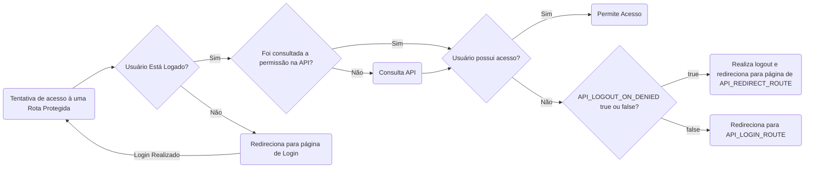

# Intranet Permission CI4

Esse pacote trata-se de um Filter para ser utilizado com o framework CodeIgniter 4 (CI4) para consumo da API de permissões da intranet do Instituto de Arquitetura e Urbanismo (IAU). Ele trabalha em conjunto com a biblioteca de autenticação senhaunica-ci4, que faz a autenticação no sistema, coletando os dados do usuário e consultando na base da intranet do IAU se o usuário possui permissão de acesso ao sistema e, em caso afirmativo, qual seu nível de permissão. 

As diretivas necessárias para seu funcionamento são definidas no arquivo .env do CI4 e serão explicadas adiante. 

# Instalação

    composer require iauusp/intranet-permission-ci4

# Configuração

## Arquivo app/Config/Filters.php

Após a instalação, deve ser criado um alias no arquivo app/Config/Filters.php para apontar para o Filter. Exemplo:

    ...
    use Iauusp\IntranetPermissionCi4\PermissionFilter;
    
    class Filters extends BaseFilters
    {
    ...
    public array $aliases = [
    ...
    'intranetPermission' => PermissionFilter::class
    ...
## Arquivo app/Config/Routes.php

Após a criação do alias do Filter, basta fazer a chamada nas Rotas desejadas, no arquivo app/Config/Routes.php, incluindo nas configurações destas rotas a chamada *'filter' => 'intranetPermission'*. Exemplo:

    $routes->get('/', 'Teste::index',  ['as' => 'index', 'filter' => 'intranetPermission']);

A chamada sem argumentos exige apenas que o usuário esteja logado, sem permissões especiais. Pode-se passar como argumento o tipo de acesso mínimo necessário para acesso à rota, sendo aceitos 5 níveis diferentes, listados a seguir, em ordem crescente:

 - Usuario
 - Intermediario
 - Avancado
 - Gerente
 - Administrador

Por exemplo, numa chamada de rota para permissão mínima "Avancado", os usuários com permissão "Avancado", "Gerente" e "Administrador" teriam acesso. Os de nível "Intermediario", "Usuario" ou aqueles sem permissões especiais cadastradas seriam negados. Neste caso, a chamada do Filter no arquivo Routes.php ficaria da seguinte forma:

    $routes->get('/', 'Teste::index',  ['as' => 'index', 'filter' => 'intranetPermission:Avancado:']);

## Arquivo .env

No arquivo .env são configuradas as diretivas necessárias para o funcionamento do Filter. São apresentadas e explicadas a seguir:

### Configuração para uso da Senha Única USP
**SENHAUNICA_KEY** = key do sistema USP para autenticação no sistema
**SENHAUNICA_SECRET** = chave cadastrada no sistema USP
**SENHAUNICA_CALLBACK_ID** = ID do sistema cadastrado

### Configuração da API para permissões Intranet IAU
**API_SYSTEM_ID** = ID do sistema na base da Intranet do IAU
**API_TOKEN** = Token do sistema na base da Intranet do IAU
**API_BASE_URL** = URL para consulta da permissão
**API_REDIRECT_ROUTE** = nome da rota para redirecionamento após sucesso no login E para acesso negado, caso o logout automático esteja setado como false
**API_LOGIN_ROUTE** = nome da rota para redirecionamento do login do sistema
**API_LOGOUT_ON_DENIED** = true|false - define se, ao entrar numa rota não permitida, se o logout deve ser efetuado ou não. Caso false, o usuário é redrecionado para a rota configurada em API_REDIRECT_ROUTE 

# Comportamento

Ao utilizar o Filter, o sistema segue o seguinte fluxo:

# Sessão em caso de sucesso

Caso o usuário esteja logado e com permissão para Rota desejada, As seguintes sessões são criads e podem ser resgatadas da seguinte forma:

- session()->get('oauth_user.loginUsuario') => Nº USP do Usuário
- session()->get('oauth_user.nomeUsuario') => Nome completo do Usuário
- session()->get('oauth_user.emailPrincipalUsuario') => E-mail principal do Usuário
- session()->get('user_permission') => Permissão do Usuário para o sistema selecionado (Administrador, Gerente, Avancado, Intermediario, Usuario ou Logado)
- session()->get('user_level') => valor inteiro referente ao campo user_permission, sendo Administrador=5, Gerente=4, Avancado=3, Intermediario=2, Usuario=1 ou Logado=0
